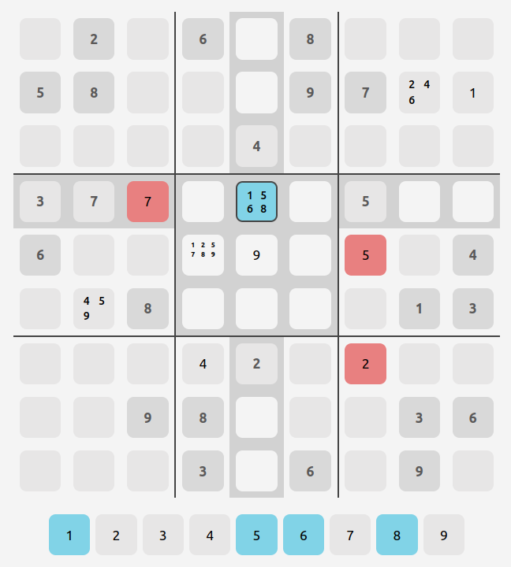

# dosuku

Simple sudoku game made with React

Give it a try [here](https://toberge.github.io/dosuku/)!

# Features

- [x] Sudoku board
- [x] Solution check
- [x] Editable number tiles
  - With the ability to select multiple numbers  
    (in case the player is unsure about what number fits in a tile)
- [x] Blocked puzzle-preset tiles
- [x] Marked tiles
  - Implemented as _multiple numbers selected_ for a tile
- [x] Different boards
  - Taken from [here](https://dingo.sbs.arizona.edu/~sandiway/sudoku/examples.html)
- [x] Language setting, of course
- [x] Keyboard shortcuts (1-9, Enter)
- [ ] Anything else that is missing

# Resources used

[This guide](https://dev.to/halilcanozcelik/create-a-multi-language-website-with-react-context-api-4i27)
to using Context for a multilingual site